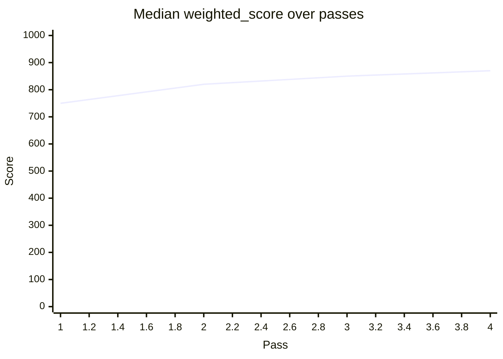

# METRICS-AND-TIMESERIES — Tracking ergonomic metrics over time

The audit produces scorecards per-pass. Across passes, this becomes a time series. Tracking the time series surfaces:

- Which dimensions are improving fastest?
- Which surfaces resist improvement?
- When did the slope change (and what triggered it)?
- How does the tool compare to similar tools at similar phases?

---

## What to track

### Per-pass artifacts (durable; already produced)

- `audit/scorecard_pass_<N>.md`
- `audit/agent_surfaces_pass_<N>.jsonl`
- `audit/uplift_diff.md` (Pass N → N+1)
- `audit/regression_alerts.md`
- `audit/agent_simulations/post_pass_<N>/summary.md`

### Cross-pass time series (synthesized)

Build `audit/metrics_timeseries.md` AND `audit/metrics_timeseries.jsonl`:

```jsonc
{
  "pass":              1,
  "completed_at":      "2026-04-01T...",
  "target_sha":        "abc123",
  "rubric_version":    "...",
  "median_weighted":   750,
  "mean_weighted":     742,
  "surfaces_above_bar": 28,
  "surfaces_total":    50,
  "median_uplift_vs_prior": null,
  "regressions":       0,
  "applied_recs":      0,
  "deferred_recs":     0,
  "fresh_eyes_rounds": 0,
  "phase_9_round_trips_median": 4
}
```

One JSONL line per pass. Append on Phase 10.

---

## Visualizing the time series

### Pass-over-pass median (markdown table)

```markdown
| Date       | Pass | Median weighted | Surfaces ≥ 750 | Notes |
|------------|------|------------------|------------------|-------|
| 2026-04-01 | 1    | 750              | 28/50 (56%)      | initial |
| 2026-05-06 | 2    | 820              | 35/50 (70%)      | applied U-1..U-6 |
| 2026-06-01 | 2*   | 815              | 35/50 (70%)      | weekly check; -5 on flag__verbose; investigated |
| 2026-07-01 | 3    | 850              | 41/50 (82%)      | quarterly Pass-N+1; idea-wizard adds |
```

### Per-dim trend

```markdown
                   pass1  pass2  pass3  pass4
intuitiveness:      650    750    800    850
ergonomics:         680    760    780    800
parseability:       700    900    920    920
error_pedagogy:     500    750    800    850
intent_inference:   400    700    750    750
self_doc:           600    800    850    900
composability:      750    800    830    850
determinism:        800    800    820    850
safety:             700    800    820    830
regression_resist:  300    750    850    900
ease_of_use:        650    750    800    830
```

The dims that lag (intuitiveness, ergonomics) need targeted recs in pass 4.

### Heatmap evolution

For each pass, render `audit/heatmap_pass_<N>.svg` via `scripts/render_heatmap.sh`. Comparing pass-1 vs pass-3 heatmaps shows where the red has cleared and where it persists.

---

## What "good" looks like (over time)

Expected trajectory for a typical T2 audit:

```
pass 1:  median +70 pts (lots of low-hanging fruit)
pass 2:  median +30 pts (deferred recs)
pass 3:  median +15 pts (residual)
pass 4:  median +10 pts (cosmetic)
pass 5+: median +5 pts (drift catch)
```

If pass 3 still shows +50 pts, either:
- The audit was too aggressive in pass 1-2 (regressions emerged)
- There were major deferred recs that weren't actually deferred

If pass 1 shows < 30 pts, either:
- The tool was already excellent
- The audit was too conservative

Use the time series to detect both.

---

## Comparing across tools

For the user's portfolio of tools, compare per-tool trajectories:

```markdown
| Tool         | Pass 1 median | After 4 passes | Slope (pts/pass) |
|--------------|----------------|------------------|--------------------|
| dcg          | 850            | 920              | +18 |
| bv           | 880            | 950              | +18 |
| am           | 820            | 900              | +20 |
| ubs          | 800            | 880              | +20 |
| cass         | 880            | 940              | +15 |
| (new tool X) | 650            | 800              | +37 (steeper; younger) |
```

Tools at similar maturity should show similar slopes. Outliers signal:
- Stalled audits (slope < 5)
- Particularly successful methodology applications (slope > 25)

---

## Per-surface sparklines

For the most-watched surfaces, show per-pass score:

```
surface_id: verb__list
   pass 1: 700 ████████
   pass 2: 850 ████████████
   pass 3: 880 █████████████
   pass 4: 900 █████████████
```

In `audit/surface_sparklines.md`. Useful for tracking the health of canonical surfaces.

---

## Regression history

Track `regression_alerts.md` across passes:

```jsonc
{
  "pass":          3,
  "regressions":   [
    {
      "surface_id":     "flag__verbose",
      "dim":            "composability",
      "prior_score":    800,
      "new_score":      770,
      "delta":          -30,
      "cause":          "Added stderr log line in --verbose mode that contaminates piped stdout (R-014.s2)",
      "resolution":     "moved log line to dedicated stderr writer; rec R-024 filed"
    }
  ]
}
```

History documents which recs caused regressions (lessons learned).

---

## Multi-pass weighted_score evolution

For visual flair, render an SVG line chart per surface:

> **Note.** The renderers below are **workspace-local scripts that the user creates** (the skill does not ship them). The convention is to live them under `<SIBLING>/audit/scripts/` so they sit beside the data they consume. Snippet below assumes you've authored `audit/scripts/render_per_surface_chart.sh` per the example skeleton further down.

```bash
# audit/scripts/render_metrics_chart.sh (workspace-local) — produces SVG for each tracked surface
for sid in $(jq -r '.surface_id' audit/agent_surfaces.jsonl | sort -u | head -10); do
  bash audit/scripts/render_per_surface_chart.sh "$sid" > "audit/charts/${sid}.svg"
done
```

Each chart shows the surface's weighted_score across passes; useful for "is this surface getting better?"

---

## When metrics show stagnation

If median uplift has been < 5 pts for 3+ consecutive passes:

- The audit has captured most accessible value
- Switch to maintenance mode (re-score-only quarterly + simulate-only monthly)
- Stop running full passes unless tool surface changes materially

This is healthy convergence per CONTINUOUS-IMPROVEMENT.md.

---

## When metrics show regression

If median weighted_score DROPPED across passes (> 20 pts):

- Investigate: rubric_version change? Tool's surface area grew (new low-scoring verbs)?
- Per VERIFICATION-FIRST.md, re-verify scoring evidence
- File a bead to investigate root cause

---

## Per-archetype expected baselines

```markdown
| Archetype                  | Initial median | After 4 passes | Slope |
|----------------------------|----------------|------------------|-------|
| search-tool                | 700–800        | 850–900          | +15–25 |
| package-manager            | 600–750        | 800–850          | +15–20 |
| hook-tool                  | 800–900        | 920–960          | +10–15 |
| issue-tracker              | 700–850        | 850–920          | +15–20 |
| daemon-cli                 | 600–700        | 750–820          | +12–18 |
| mcp-server                 | 750–850        | 850–920          | +12–18 |
```

Use as comparison baseline. If your tool deviates wildly from its archetype's expected slope, investigate.

---

## Storing the time series

### Option A: Inline in audit workspace

```
<sibling>/audit/metrics_timeseries.jsonl   # one line per pass
<sibling>/audit/metrics_timeseries.md      # human-readable table
<sibling>/audit/charts/                    # per-surface SVGs
```

Committed to git; survives across passes.

### Option B: External datastore

For cross-tool analysis (the user's whole portfolio):

```
~/.config/agent-ergo/portfolio_metrics.jsonl
```

One line per (tool, pass) tuple. Aggregated across all audited tools.

```bash
# Aggregate across portfolio
jq -s 'group_by(.tool_name) | map({tool: .[0].tool_name, passes: length, median_now: .[-1].median_weighted})' \
  ~/.config/agent-ergo/portfolio_metrics.jsonl
```

---

## Visualization targets

### Static SVG (no dependencies)

A workspace-local `audit/scripts/render_metrics_timeline.sh` (you author it once per audit workspace) produces an SVG line chart from the JSONL.

### Mermaid (for embedding in markdown)



Render via existing markdown viewers.

### Web dashboard (optional)

For T5+ portfolios, a small dashboard at `~/.config/agent-ergo/dashboard/index.html` consuming `portfolio_metrics.jsonl`. Built once; queried as needed.

---

## Periodic-pulse metrics

For T3+ tools running weekly re-scores:

| Metric | Target |
|--------|--------|
| Surface count delta | < 5% per week (stability) |
| Median weighted delta | < 5 pts per week (stability) |
| Regressions per week | 0 (drift caught at PR time) |
| New surfaces (added) | tracked separately |

If weekly metrics show > 5% surface count delta, investigate (tool may be expanding fast).

---

## Cross-references

- `methodology/CONTINUOUS-IMPROVEMENT.md` — cadence
- `methodology/CI-INTEGRATION.md` — automated re-score schedule
- `methodology/CASS-MINING-RECIPES-DEEP.md` — frequency signal feeds metrics
- `scripts/diff_scorecards.sh` — produces single-pass uplift; aggregate yourself for time series
- `scripts/render_heatmap.sh` — per-pass heatmaps; aggregate for evolution view
